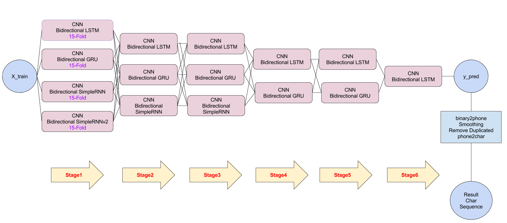

MLDS HW1

---

1.	使用 Python 3.5.2 、 Keras 2.0.8 、 Tensorflow 1.3.0

---

2.	sh 檔中使用 'python' 來 call python 3

	若您的 python 3 是使用 'python3'  才能 call，則必須要修改

---

3.	Keras 使用 Tensorflow Backend

---

4.	train_mean_box, train_std_box 

	為記錄 training features 的平均值、標準差

	用於標準化用

---

5.	Model 架構

	rnn: simpleRNN

	cnn: Conv1d + simpleRNN

	best: 

	

---

6.	model_best.py 

	由於 Stacking 的整個流程非常長

	所以通常不會一次去 train 完

	因此，我將  training code comment 了

	train 時，看目前在哪個 Stage，要用哪個部分的 training code，

	再進行 uncomment，然後才跑

---

7.	best 於 Azure NC6 VM 上， GPU: 1 x Tesla K80，運行時間約 8 min
	
	如果是剛啟動 VM 第一次跑 hw1_best.sh，時間有可能超過十分鐘

	第二次和之後跑就會順順的，可以在十分鐘之內

	-> 使用 Microsoft Azure NC6

	-> 停止 VM、解除配置

	-> 啟動 VM

	-> ssh 連接 VM 並 cd 至 hw1

	-> 第一次執行 time ./hw1_best.sh data/ prediction.csv

	-> 第一次結果如下

			real 10m19.970s

			user 7m22.726s

			sys 2m11.134s

	-> 第二次執行 time ./hw1_best.sh data/ prediction.csv

	-> 第二次結果如下

			real 7m48.842s

			user 7m22.043s

			sys 2m9.129s

	=>  如果能按照 rnn、cnn、best 的順序來跑，則應該全部都能壓在十分鐘之內 

---

8.	Kaggle Edit Distance Score (private/public)

	best: 6.99759/7.14689

---
